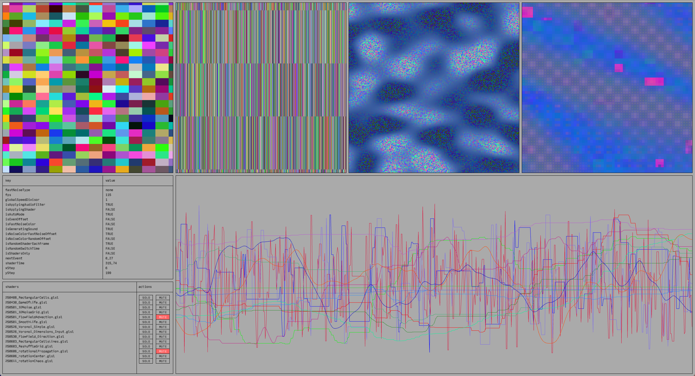
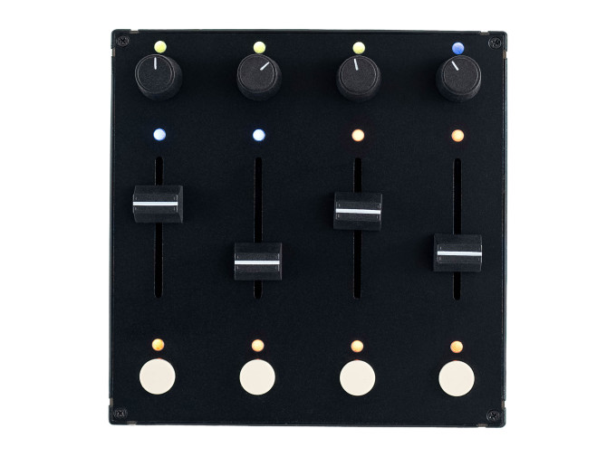
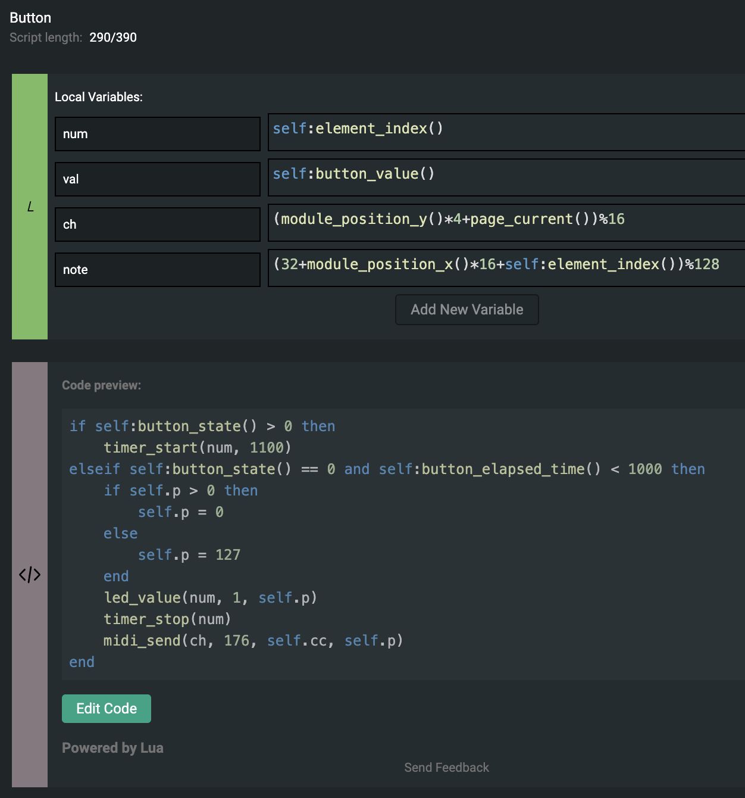
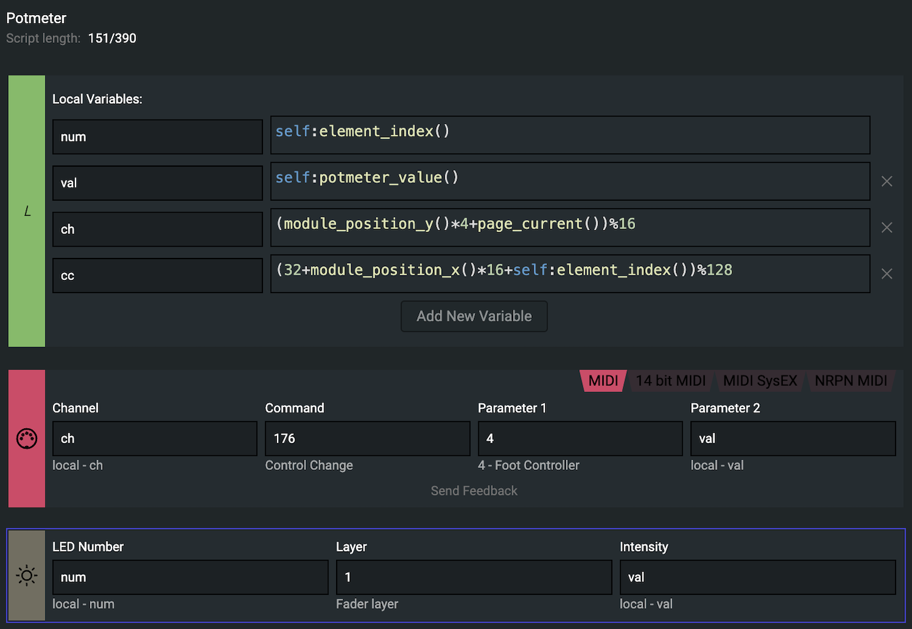

# RAUSCHEN

*RAUSCHEN* is an emergent performance installation exploring the possibility space of a 1000x1000 pixel image. It generates a random, but orderly grid of pixels or cells according to a range of RNG and noise algorithms. These regular textures are fed into a modular shader system, consisting of contributions from conversations with currently popular LLMs. 
*RAUSCHEN* then freely mixes and recursively feeds back their results into emergent textures of visual patterns and auditory noise, flashing by in quick succession. A control application constantly monitors its output in numbers and parameters, is able to save the generated textures to disk and provides the option to influence the pattern generation in order to perform a more curated visual experience. 
While current image generation models denoise their random input textures using techniques under the broad term diffusion, *RAUSCHEN* uses procedural generation methods in order to achieve the opposite effect, infusing its fundamental noise textures with structural patterns for now only recognisable by the viewer.

 

*Is this what being trained must feel like to an AI?*

 

# RAUSCHEN_processing

*RAUSCHEN* is driven by a *Processing 4.3.2* application running on *macOS* that creates a buffer of custom dimensions and fills it with randomly colored cells of pixels each frame, called *Rauschen_processing*.

## colors

The color of the cells is determined by a range of pseudo random number generators that determine their RGB values:

- individual random number for each value and each cell

- a leading color determined by a custom Noise class, with each cell having a slight offset from that leading color that is also calculated by a custom Noise class

- a leading color determined by a custom Noise class, with each cell having a slight offset from that leading color that is calculated by a random one of the Noise types from the [FastNoiseLite](https://github.com/Auburn/FastNoiseLite) lib

- the entire grid of cells determined by a random one of the Noise types from [FastNoiseLite](https://github.com/Auburn/FastNoiseLite) lib

## cells

The cells can range in dimensions from 1 up to the dimensions of the buffer, and can be either square or rectangular. The dimensions of the cells, called xStep and yStep, are determined by a custom Noise class. All cells always have the same dimensions in a single frame.

## noise class

For many operations, a custom Noise class is used that can return either a Noise value from 0 to 1, a Boolean determined by Noise, a Noise range from a custom low and high value, a Noise range from a custom low value range and a custom high value range, or each of those with a custom bias. The Noise class uses Processing's built in Perlin Noise. The increment with which they are computed can be set on initialization.

Noises are added to a list of Noises so they can be send to the control application.

## shaders

Occasionally, instead of displayed the grid of cells, *RAUSCHEN* will apply a random shader from a list of shaders to the buffer. The shaders take a texture called tempBuffer as an input that is either the last grid of cells OR the last shader output. Depending on which event has fired last, this can be either the same shader multiple consecutive frames in a row, or a random different shader each frame, effectively mixing their outputs together.

## events

A random event happens every X seconds if *Auto Mode* *(isAutoMode)* is active. These include:

- setting up new dimensions for either the grid of cells or the buffer *setNewGridWithNoise() / resizeBuffer()*

- switch to applying shaders instead of displaying the grid of cells *isApplyingShaders*

- switch between the grid of cells' colors being determined by the options described above ("Colors") *isNoiseColorRandomOffset / isNoiseColorRandomOffset / isFastNoiseColor / isFastNoiseColorFastNoiseOffset*

- switch between using the same shader in consecutive frames or using a random different shader each frame *isRandomShaderEachFrame*

The time between two events can either be set manually, or be picked at random between each frame and a maximum interval.

## sound

Each frame, a thread-safe copy is made of the buffer. Using the digital signal processing in [Wellen](https://github.com/dennisppaul/wellen), a sound sample is created from the buffer's pixels. The sample consists of a either horizontal, vertical or diagonal line of pixels, whose average color channel values ((R + G + B) / 3) are mapped to a frequency range. The sample is then passed through a band pass filter, where frequency and bandwidth are determined by - you guessed it - the custom Noise class.

## screenshots

At a set interval, *RAUSCHEN* will create a new thread in order to save the display buffer as a screenshot, with a timestamp in its file name. If the screenshot folder (**'temp'**) exceeds a set number of screenshot, the oldest one will be deleted.

## controls

Although there is a separate application to control *RAUSCHEN*, there are some rudimentary controls available:

- **'F' key:** show rudimentary debug info

- **'P' key:** print debug info to console

- **'A' key:** toggle *Auto Mode* (enable/disable automatic events)

- **'S' key:** choose a random event now

- **'N' key:** toggle audio

- **SPACE:** halt the entire application (good for photos)

In order to map the application to a surface with a projector, the window's menu bar can be disabled by the toggle *isUndecorated*. The window can then be resized with the **'+'** and **'-'** keys, and moved around the screen with the **arrow keys**.

 

# RAUSCHEN_processing_controls

*RAUSCHEN* is controlled by another *Processing 4.3.2* application running on *macOS* called *RAUSCHEN_processing_controls*.

## screenshots

*RAUSCHEN_processing_controls* scans the folder that *RAUSCHEN* saves screenshots to a folder (**'temp'**) in a set interval. It displays the latest 4 a row of screenshots. When clicked on, it will save the corresponding screenshot to a permanent folder (**'saved'**).

## displayed data

*RAUSCHEN* receives a set of data from *RAUSCHEN_processing* via *OSC* messages:

- **'/noises'** contains the values of all the Noises from the list of Noises, in this case mapped from 0 to 1, and is displayed as differently colored graphs

- **'/info'** contains the variable names and their values, which are determined manually or by events, plus some debug information, and is displayed as a list of variable names and their values

- **'/shaderNames'** contains the names of the shaders added to the main application and is displayed as a list of available shaders

- **'/shaderChoice'** contains the value determining which shader is currently in use, shown by the corresponding shader being highlighted in the list of available shaders

## controls

The variables present in the **'/info'** message can be set by *RAUSCHEN_processing_controls* sending *OSC* messages containing the corresponding key and value pairs back to *RAUSCHEN*. These variables will be overridden by the events from *Auto Mode* if it is active.

The list of shaders displayed in *RAUSCHEN_Processing_controls* contains buttons to **SOLO** and **MUTE** them, similar to audio tracks in a DAW. This enables to mix and match shaders freely when *isRandomShaderEachFrame* is active, or determine which random shaders can be chosen for consecutive frames when it is not active.

## midi-controller

*RAUSCHEN_processing_controls* uses the *Intech Studio Grid PBF4* midi controller. Its buttons and potentiometers are assigned to *MIDI* channels with the *Intech Studio Grid Editor 1.5.7*. *RAUSCHEN_processing_controls* listens to the set up *MIDI* channels, assigns their values to the corresponding variables and sends those pairs back to *RAUSCHEN_procesing* via *OSC* messages. 

Some logic, mainly for enabling short and long presses, as well as saving variable values across page changes, is applied and saved directly to the controller in the form of *LUA* scripts.

